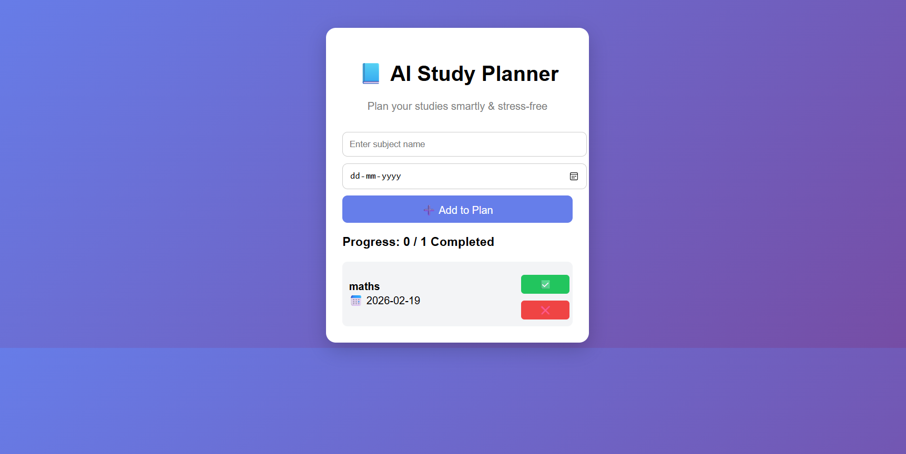

# ai-study-planner
A colorful and simple AI Study Planner to help students plan subjects, track progress, and stay organized.
# 🎓 AI Study Planner

A colorful and simple AI Study Planner to help students plan subjects, track progress, and stay organized.

---

## ✨ Features
- Add subjects and study plans
- Track daily progress
- Simple and colorful UI
- Beginner-friendly project

---

## 🛠 Tech Stack
- HTML
- CSS
- JavaScript

---

## ▶ How to Run
1. Download or clone this repository
2. Open `index.html` in your browser

---

## 📸 Screenshot

---

## 👩‍💻 Author
Sneha Jadhav  
B.Sc Computer Science Student
